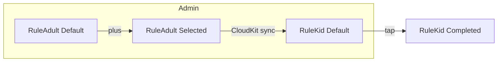

# Mindful Home — Product & Architecture Spec v 0.9

*(single-page markdown file for design & dev hand-off)*

---

## 1 Purpose & Elevator Pitch

A **family app for iPad *****and***** iPhone** that lets parents define *rules*, *chores* and *rewards*.
Kids earn **“peanuts”** (points) for completing tasks and can **redeem** rewards.
MVP = **1 kid, same‑profile sync across the user’s iOS devices (Core Data + CloudKit)**; works fully offline and auto‑syncs when connectivity returns. Road‑map: multi‑kid, Firebase cross‑platform.

---

## 2 Roles

| Role              | Capabilities                                                     | Location in UI           |
| ----------------- | ---------------------------------------------------------------- | ------------------------ |
| **Adult (Admin)** | • Create / edit Rules, Chores, Rewards• Protected by 4‑digit PIN | **Admin** tab            |
| **Kid**           | • Complete Rules & Chores• Spend peanuts in Reward Shop          | **Home** & **Shop** tabs |

*(Both roles share the same Apple / Google login; adult features are PIN‑gated.)*

---

## 3 Navigation Map

```text
Launch → Login / Onboarding (3 slides) → Admin (first run)
Return visits → Home

Persistent TabView
 ├─ Home                – Balance, Rules, Chores
 ├─ Shop                – Reward Shop / Basket
 ├─ Admin (PIN lock)    – Manage Rules, Chores, Rewards
 └─ Settings            – Language (EN/NL), auth, change PIN
```

---

## 3.1 Page‑by‑Page Breakdown

| Page                                 | Purpose                                                | Key UI Elements                                                                                                                   | Main Interactions                                                                                      |
| ------------------------------------ | ------------------------------------------------------ | --------------------------------------------------------------------------------------------------------------------------------- | ------------------------------------------------------------------------------------------------------ |
| **Login / Authentication**           | Let the parent sign in with Google or email + password | App logo, Google button, "Continue with email" button, footer links (Privacy, T\&C)                                               | Successful auth → Onboarding (first run) or Home (returning)                                           |
| **Onboarding (3 slides)**            | Explain peanuts system & dual‑role concept             | Horizontally‑paged hero illustrations, headline + body copy, progress dots, **Button M** "Get started"                            | Final slide → Create‑PIN flow, then Admin page                                                         |
| **Create / Enter PIN**               | Secure adult‑only features                             | Numeric keypad (0‑9), four dots, "Forgot?" link                                                                                   | First run: set PIN → AdminSubsequent: verify PIN → Admin                                               |
| **Home**                             | Kid hub: earn peanuts                                  | Balance chip on top, Tab bar (Family Rules ∙ Chores), scrollable list of **RuleKidCard** or **ChoreKidCard**, empty‑state mascots | Tap card → complete task → success modal, balance animates                                             |
| **Shop**                             | Spend peanuts                                          | Segmented control: Rewards ∙ Basket, list of **RewardKidCard** or **BasketCard**, balance chip                                    | Tap reward → redeem (balance check) → confetti, card moves to Basket; tap Basket delete → remove entry |
| **Admin — “Your mindful home”**      | Create / manage content                                | Local TabView: Rules ∙ Chores ∙ Shop; header + mascot, **Button M** "Add New"; lists of **Rule/Chore/RewardAdultCard**            | Tap + → add modal; tap card → edit modal; swipe → delete                                               |
| **Settings**                         | Configuration & meta                                   | Language picker (EN / NL), Change PIN, Change email/password, Log out, version label                                              | Immediate apply for language, modal for credential changes                                             |
| **Success Modal & Confetti Overlay** | Reinforce positive action                              | Lottie animation, headline (“Great job!”), **Button S** close                                                                     | Auto‑dismiss after 2 s; haptic feedback                                                                |

## 3.2 User Stories

### Primary Adult Flow

1. **Install & Sign‑in** on iPhone → Google or email auth.
2. **Create 4‑digit PIN** during onboarding.
3. **Define Rules / Chores / Rewards** in Admin tab.
4. **Pick up iPad** (same Apple ID) → Core Data + CloudKit auto‑sync shows identical content.
5. **Monitor Kid progress**; edit tasks any time (changes sync to both devices).
6. **Manage subscription** in Settings.

### Primary Kid Flow (shared device or personal)

1. Launches app → lands on **Home** tab.
2. Taps a Rule/Chore → success modal, balance increments.
3. Navigates to **Shop** → redeems a Reward; confetti overlay.
4. Sees new balance & Basket update across iPhone/iPad almost instantly via CloudKit.

### Edge Cases

* **Offline usage**: edits queue locally; CloudKit merges once online.
* **Forgot PIN**: Kid cannot enter Admin; Adult resets PIN via Settings re‑auth.

---

## 4 Data‑Storage Strategy

| Stage   | Tech                                         | Why                                                                              | Migration path                                |
| ------- | -------------------------------------------- | -------------------------------------------------------------------------------- | --------------------------------------------- |
| **MVP** | **Core Data (SwiftData) + CloudKit enabled** | Seamless iCloud sync between iPad & iPhone on same Apple ID; still works offline | Export JSON to Firebase later for Android/Web |

\-------|------|-----|----------------|
\| **MVP** | **Core Data (SwiftData)** | Zero server work, first‑party tooling | Flip CloudKit flag for iCloud, or export JSON to Firebase later |

---

## 5 Data Model (Core Data / SwiftData)

```swift
enum TaskKind : String, Codable { case rule, chore, reward }
enum Category : String, Codable { case security, respect, fun }      // extendable

@Model
final class Task {
    @Attribute(.unique) var id         : UUID
    var kind        : TaskKind
    var title       : String
    var peanuts     : Int
    var category    : Category
    var createdAt   : Date
    var isSelected  : Bool    // picked by Adult, visible to Kid
    var isCompleted : Bool    // completed by Kid (rules & chores)
    var inBasket    : Bool    // redeemed rewards
}
```

*Balance* = `SUM(peanuts) WHERE isCompleted == true`.
Add `kidID` later for multi‑profile.

**Cloud sync note:** CloudKit replicates the Core Data store across the user’s iOS devices; conflict policy = “newest wins”. No extra code beyond the `iCloudContainerIdentifier` entry in the project settings.

---

## 6 Core Flows

### 6.1 Rule / Chore Completion (Kid)

1. Kid taps card → `isCompleted = true`.
2. Peanuts added to balance.
3. Success modal + haptic / sound; card dims (cannot tap again).

### 6.2 Reward Redemption (Kid)

1. Kid taps reward card.
2. Guard → `balance ≥ reward.peanuts`.
3. On success `inBasket = true`, peanuts deducted, confetti animation; card moves to **Basket**.
   *(No approval, no undo in MVP.)*

---

## 7 Admin Operations


### Summary
1. **Tabs and Empty State**:
   - The Admin page has three tabs: **Rules**, **Chores**, and **Shop**.
   - Each tab shows an empty-state message (e.g., "You don’t have family rules yet") and an **"Add New"** button.

2. **Full-Screen CatalogueModal**:
   - Clicking "Add New" within a tab opens a **full-screen modal** (e.g., "Add Rule").
   - The modal displays three categories, each with six predefined items:
     - **Security**: Six rule rows.
     - **Respect & Boundaries**: Six rule rows.
     - **House & Coziness**: Six rule rows.
   - The modal should be scrollable to accommodate all items.

3. **Card States**:
   - **Default state**: Light-tinted background, category accent color for text/icons, and **`＋`** action icon.
   - **Selected state**: Dark-tinted background, white text/icons, and **`🗑`** action icon.
   - Tapping **`＋`** marks the item as selected; tapping **`🗑`** deselects it.

4. **Sync Behavior**:
   - When an item is selected, it appears under the corresponding tab in the Admin view and in the Kid's Home view.
   - Kids can complete but not delete these items.
   - Adults can remove items anytime, which updates both views.
   - **Closing the modal** saves the selection and updates the interface accordingly.


### Catalogue Data Source

* Located at `Resources/SeedData/` as **JSON** files:

  * `rules.json`
  * `chores.json`
  * `rewards.json`
* Structure:

```json
{
  "category": "Security",
  "items": [
    { "id": "rule_001", "title": "Tell us where you're going. So we always know you're safe", "peanuts": 1 },
    { "id": "rule_002", "title": "Bring your Apple Watch outside. So we can call you if needed", "peanuts": 1 }
  ]
}
```

* These files are embedded in the bundle; `SeedLoader` decodes and provides `[TaskTemplate]` arrays to the CatalogueModal.

> The images you provided (img1–img3) were OCR’d into the JSON lists above during asset preparation.

---

### Modal Interactions

| Tap target  | Effect                                                                                                                                                |
| ----------- | ----------------------------------------------------------------------------------------------------------------------------------------------------- |
| Row **⊕**   | Marks the template as **Selected** (row bgcolor switches to Selected variant); adds or updates a `Task` entity with matching `templateID` + defaults. |
| Row **🗑**  | Un‑selects (deletes existing Task).                                                                                                                   |
| **Close ×** | Saves context and dismisses modal.                                                                                                                    |

No free‑text or numeric input fields exist in MVP; everything is driven by the JSON catalogue.

| Field        | Type              | Notes                    |
| ------------ | ----------------- | ------------------------ |
| Title        | TextField         | Validates non‑empty      |
| Peanut value | Stepper (1 … 20)  | Default 1                |
| Category     | Segmented control | Security · Respect · Fun |
| **Save**     | Button            | Creates or updates Task  |

---

| Field        | Type              |
| ------------ | ----------------- |
| Title        | TextField         |
| Peanut value | Stepper (1 … 20)  |
| Category     | Segmented control |
| **Save**     | Button            |

---

## 8 Custom UI System (global tokens)

| Token              | Value                                                                                   |
| ------------------ | --------------------------------------------------------------------------------------- |
| Font               | **Inter Medium 24 pt**                                                                  |
| Vertical padding   | **14 pt**                                                                               |
| Horizontal padding | **24 pt**                                                                               |
| Card radius        | **20 pt**                                                                               |
| Button M           | pill, text‑only, 24 pt                                                                  |
| Button S           | icon‑only 24 × 24 pt, circular                                                          |
| Icons              | **Custom SVGs only**: `icon_peanuts`, `icon_plus`, `icon_delete` (no SF Symbols in MVP) |

> **All UI assets (icons, mascots, Lottie files) live under \*\*\*\*`Assets.xcassets/CustomUI/`**. This guarantees one source‑of‑truth when updating or theming.

### 8.1 Category Colour Swatches

| Category             | BG Default | BG Selected | Text/Icon Default | Text/Icon Selected |
| -------------------- | ---------- | ----------- | ----------------- | ------------------ |
| Security             | `#EAF3EA`  | `#7FAD98`   | `#7FAD98`         | `#FFFFFF`          |
| Respect & Boundaries | `#FAEDDB`  | `#D78C28`   | `#D78C28`         | `#FFFFFF`          |
| Fun / Other          | `#E4F0F8`  | `#7F9BAD`   | `#7F9BAD`         | `#FFFFFF`          |

\--- Colour Swatches

| Category             | BG Default | BG Selected | Text/Icon Default | Text/Icon Selected |
| -------------------- | ---------- | ----------- | ----------------- | ------------------ |
| Security             | `#EAF3EA`  | `#7FAD98`   | `#7FAD98`         | `#FFFFFF`          |
| Respect & Boundaries | `#FAEDDB`  | `#D78C28`   | `#D78C28`         | `#FFFFFF`          |
| Fun / Other          | `#E4F0F8`  | `#7F9BAD`   | `#7F9BAD`         | `#FFFFFF`          |

---

## 9 Component Library & Page Component Map

> **Shared layout tokens**: Horizontal padding 24 pt, Vertical padding 14 pt, Inner spacing 4 pt, Font Inter Medium 24 pt, Card radius 20 pt, Min height 72 pt, No shadow.

### 9.1 Card Specs (Adult ⇄ Kid parity)

| Component           | Screen(s)                              | Anatomy (L–R)                                            | States & Icons                                                                                                  | Behaviour / Data flags                     |
| ------------------- | -------------------------------------- | -------------------------------------------------------- | --------------------------------------------------------------------------------------------------------------- | ------------------------------------------ |
| **RuleAdultCard**   | Admin › Rules                          | Text · Divider · Peanuts value · `icon_peanuts` · Action | **Default** BG Category‑Default, Action `icon_plus`  ·  **Selected** BG Category‑Selected, Action `icon_delete` | `isSelected` toggles; delete removes task. |
| **ChoreAdultCard**  | Admin › Chores                         | *same*                                                   | *same*                                                                                                          | `kind = .chore`.                           |
| **RewardAdultCard** | Admin › Shop                           | *same*                                                   | *same*                                                                                                          | `kind = .reward`.                          |
| **RuleKidCard**     | Home › Family Rules                    | No action icon                                           | **Default** (BG Category‑Default)  ·  **Completed** (BG Category‑Selected, 70 % opacity)                        | `isCompleted = true` on tap → peanuts ++.  |
| **ChoreKidCard**    | Home › Chores                          | *same*                                                   | Default / Completed                                                                                             | *same behaviour*.                          |
| **RewardKidCard**   | Shop › Rewards                         | *same*                                                   | **Default** / **In Basket**                                                                                     | Balance check; sets `inBasket = true`.     |
| **BasketCard**      | Shop › Basket                          | RewardKidCard + `icon_delete`                            | In Basket only                                                                                                  | Delete hides; no refund.                   |
| **GoodAdultCard**   | Home › Chores (system‑generated chore) | As ChoreKidCard, **non‑deletable**                       | Default / Completed                                                                                             | `deletable = false`.                       |

### 9.2 Component Map per Page

| Page         | Components (top → bottom)                                                                                             |
| ------------ | --------------------------------------------------------------------------------------------------------------------- |
| **Home**     | BalanceChip · TabBar(Family Rules/Chores) · **RuleKidCard** list **or** **ChoreKidCard** list · EmptyMascot if none   |
| **Shop**     | BalanceChip · SegmentedControl(Rewards/Basket) · **RewardKidCard** list · **BasketCard** list                         |
| **Admin**    | Header + Mascot · LocalTabBar(Rules/Chores/Shop) · **RuleAdultCard** / **ChoreAdultCard** / **RewardAdultCard** lists |
| **Settings** | Form rows (LanguagePicker, ChangePIN, AuthButtons, RestorePurchaseButton)                                             |
| **Success**  | Half‑sheet **MascotModal** *or* Full‑screen **ConfettiOverlay**                                                       |
| **Paywall**  | Illustration · Headline · Feature bullets · Price toggle (Monthly/Yearly) · Subscribe / Restore buttons               |

### 9.3 State Diagram (Adult → Kid)



### 9.4 SwiftUI Card Template (Cursor)

```swift
struct TaskCard: View {
  @Bindable var task: Task
  var isAdult: Bool
  var body: some View {
    HStack(spacing: 4) {
      Text(task.title)
      Divider()
      Text("\(task.peanuts)")
      Image("icon_peanuts")
      Spacer()
      if isAdult {
        Image(task.isSelected ? "icon_delete" : "icon_plus")
      }
    }
    .font(.custom("Inter-Medium", size: 24))
    .padding(.vertical, 14)
    .padding(.horizontal, 24)
    .background(backgroundColor)
    .cornerRadius(20)
    .onTapGesture { handleTap() }
  }
  private var backgroundColor: Color {
    task.isCompleted || task.inBasket ? task.category.selectedColor : task.category.defaultColor
  }
}
```

---

## 10 Localization

 Localization

* **Base, EN.lproj, NL.lproj**.
* Use `.stringsdict` for plural “peanut(s)”.
* Shared fonts cover both languages.

---

## 11 Sound & Animation

| Event                         | Asset          | Behaviour                                                                                                       |
| ----------------------------- | -------------- | --------------------------------------------------------------------------------------------------------------- |
| Task completed (Rule / Chore) | `success.aiff` | **Mascot Modal** (half‑sheet) with mascot pose + headline; light haptic; auto‑dismiss after 1 s or tap to close |
| Reward redeemed               | `reward.aiff`  | **Full‑screen Confetti Overlay** + “Enjoy your reward!” headline; medium haptic; modal dismisses after 2 s      |

*(Both variants reuse Lottie confetti burst; the modal variant crops to card region.)*

\-------|-------|-----------|

## 12 Extensibility Notes

| Future feature  | DB change?                   | UI impact                    |   |               |                |
| --------------- | ---------------------------- | ---------------------------- | - | ------------- | -------------- |
| Multi‑kid       | add `KidProfile`, `kidID` FK | Profile switcher in Settings |   |               |                |
| Android / web   | export JSON to Firebase      | new clients                  |   |               |                |
| Undo completion | keep history / toggle flag   | “Undo” button                |   |               |                |
| Notifications   | add `dueDate`                | local notifier               |   | add `dueDate` | local notifier |

---

## 13 Resolved Design Details

| Topic                                    | Decision                                                                                                                                                                                                     |
| ---------------------------------------- | ------------------------------------------------------------------------------------------------------------------------------------------------------------------------------------------------------------ |
| Mascot illustrations & filenames         | All SVG / PNG assets shipped in the **Assets.xcassets/Mascots/** folder; filenames follow `mascot_[state].svg` (e.g. `mascot_happy.svg`, `mascot_empty_rules.svg`).                                          |
| PIN‑reset flow                           | **Settings › Security**: “Change PIN” (requires current PIN). “Forgot PIN?” opens re‑auth sheet: Sign in with the primary app account (Google or email + password). On success, user sets a new 4‑digit PIN. |
| Success‑animation style                  | • Rule/Chore → half‑sheet mascot modal.• Reward → full‑screen confetti overlay.Both play corresponding sound + haptic.                                                                                       |
| Adaptive layouts (iPhone SE ↔ iPad 12.9) | Use SwiftUI size classes:• `compactWidth` → single‑column lists.• `regularWidth` (iPad) → dual‑pane: left list, right detail/preview\.Card max‑width: 600 pt; center content on larger screens.              |

---

## 14 Monetization & App Store Strategy   Monetization & App Store Strategy

### Trial

* **7‑day free trial** on first subscription. Auto‑renews unless cancelled at least 24 h before period end.
* Implemented as **auto‑renewing subscription** via **StoreKit 2**.

### Suggested Pricing

| Plan        | Price NL                         | Price US (≈)      | Rationale                                                    |
| ----------- | -------------------------------- | ----------------- | ------------------------------------------------------------ |
| **Monthly** | **€ 3.49 / mo**                  | **\$ 3.49 / mo**  | Low‑commitment, matches Tier 3; validates willingness to pay |
| **Yearly**  | **€ 24.99 / yr** (‑40 % vs 12×M) | **\$ 24.99 / yr** | Locks in loyalty; cheaper for families; Tier 19              |

*(App Store handles local currencies / tax.)*

### Paywall Flow

1. **After onboarding + PIN setup**, non‑subscribed users are shown **PaywallModal** before entering Admin.
2. During trial → badge shows “7 days left”.
3. Post‑trial without purchase → app switches to **Read‑only mode** (tasks are visible but not tappable).
4. Purchase or **Restore** (Settings) unlocks full functionality instantly.

### Implementation Notes

* **StoreKitKit / SwiftUI** offer wrapper; use `Transaction.currentEntitlements` to gate access.
* **Family Sharing** off for MVP; can be enabled later.
* Use `Product.SubscriptionInfo` to surface days‑left banner on Home.
* QA with StoreKit Test in Xcode + TestFlight sandbox.

---

## 15 Delivery Checklist

* [ ] **SwiftData model** (`Task.swift`) with enum‑driven colour helpers.
* [ ] **CloudKit container** set up; sync tested on iPhone + iPad.
* [ ] **Custom UI assets** organised under `Assets.xcassets/CustomUI/` (icons, mascots, Lottie animations).
* [ ] **Colour & typography tokens** defined in Asset Catalog or SwiftUI extension.
* [ ] **Component SwiftUI views**: TaskCard, BalanceChip, MascotModal, ConfettiOverlay, PaywallModal.
* [ ] **StoreKit 2** configuration (`Products.storekit`) + Paywall wiring.
* [ ] **CoreDataSeeder** for Previews & UI tests.
* [ ] **Localization files** (`Localizable.strings`, `.stringsdict`) for EN & NL.
* [ ] **UI‑test suite** (XCTest) on iPhone SE, iPhone 15 Pro Max, iPad 12.9 adapting layouts.
* [ ] **App Store Connect metadata**: screenshots (both device classes), promo text, privacy answers.
* [ ] **Audio assets** (`success.aiff`, `reward.aiff`) + haptic feedback integration.
* [ ] QA sign‑off before TestFlight submission.

---

> **Built entirely with SwiftUI + Cursor.** UIKit only if a future feature demands it. This spec supersedes all previous drafts.
